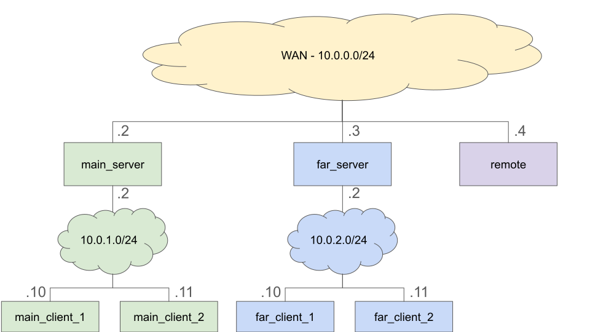

 [](https://classroom.github.com/a/cUBNOxfy)
# HEIGVD - Sécurité des Réseaux - 2024

# Laboratoire n°5 - VPN

Ce travail est à réaliser en équipes de deux personnes.
Choisissez une personne avec qui vous n'avez pas encore travaillé pour un labo du cours SRX.
C'est le **troisième travail noté** du cours SRX.

Répondez aux questions en modifiant directement votre clone du README.md.

Le rendu consiste simplement à compléter toutes les parties marquées avec la mention "LIVRABLE".
Le rendu doit se faire par un `git commit` sur la branche `main`.

## Table de matières

- [HEIGVD - Sécurité des Réseaux - 2024](#heigvd---sécurité-des-réseaux---2024)
- [Laboratoire n°5 - VPN](#laboratoire-n5---vpn)
  - [Table de matières](#table-de-matières)
- [Introduction](#introduction)
  - [Échéance](#échéance)
  - [Évaluation](#évaluation)
  - [Introduction](#introduction-1)
  - [Configuration](#configuration)
  - [Test](#test)
- [OpenVPN](#openvpn)
  - [Mise en place du CA](#mise-en-place-du-ca)
  - [Les attaquants pourraient abuser des clés privées pour intercepter, déchiffrer et modifier le trafic sécurisé, ce qui compromettrait l'intégrité et la confidentialité des communications.](#les-attaquants-pourraient-abuser-des-clés-privées-pour-intercepter-déchiffrer-et-modifier-le-trafic-sécurisé-ce-qui-compromettrait-lintégrité-et-la-confidentialité-des-communications)
  - [Réseau à réseau](#réseau-à-réseau)
  - [Remote à réseau](#remote-à-réseau)
  - [Tests](#tests)
  - [Desktop à réseau](#desktop-à-réseau)
  - [Pour faire un seul fichier de configuration pour OpenVPN, j'ai intégré les contenus des certificats et des clés directement dans le fichier de configuration. J'ai utilisé des balises `<ca>`, `<cert>`, `<key>`, et `<tls-auth>` pour inclure respectivement le certificat de l'autorité de certification (CA), le certificat du client, la clé privée du client, et la clé TLS pour l'authentification. Cela permet de regrouper toutes les informations nécessaires dans un seul fichier, simplifiant ainsi la gestion et le déploiement de la configuration VPN.](#pour-faire-un-seul-fichier-de-configuration-pour-openvpn-jai-intégré-les-contenus-des-certificats-et-des-clés-directement-dans-le-fichier-de-configuration-jai-utilisé-des-balises-ca-cert-key-et-tls-auth-pour-inclure-respectivement-le-certificat-de-lautorité-de-certification-ca-le-certificat-du-client-la-clé-privée-du-client-et-la-clé-tls-pour-lauthentification-cela-permet-de-regrouper-toutes-les-informations-nécessaires-dans-un-seul-fichier-simplifiant-ainsi-la-gestion-et-le-déploiement-de-la-configuration-vpn)
- [WireGuard](#wireguard)
  - [Création des clés](#création-des-clés)
  - [Réseau à réseau](#réseau-à-réseau-1)
  - [Remote à réseau](#remote-à-réseau-1)
      - [Chemin Aller du `echo request` :](#chemin-aller-du-echo-request-)
      - [Chemin Retour du `echo reply` :](#chemin-retour-du-echo-reply-)
  - [Test](#test-1)
  - [Bonus: Desktop à réseau](#bonus-desktop-à-réseau)
- [IPSec](#ipsec)
  - [Mise en place du CA](#mise-en-place-du-ca-1)
  - [Nous avons laissé les CSR dans `/root/ipsec/pems` de chaque machine (main, far, et remote).](#nous-avons-laissé-les-csr-dans-rootipsecpems-de-chaque-machine-main-far-et-remote)
  - [Réseau à réseau](#réseau-à-réseau-2)
      - [MainS](#mains)
      - [FarS](#fars)
  - [Remote à Réseau](#remote-à-réseau-2)
  - [Test](#test-2)
- [Comparaison](#comparaison)
  - [Sécurité](#sécurité)
  - [Facilité d'utilisation](#facilité-dutilisation)
  - [Performance](#performance)
- [Points spécifiques](#points-spécifiques)
  - [OpenVPN](#openvpn-1)
  - [WireGuard](#wireguard-1)
  - [IPSec](#ipsec-1)

# Introduction

## Échéance

Ce travail devra être rendu au plus tard, **le 29 mai 2024 à 23h59.**

## Évaluation

Vous trouverez le nombre de points pour chaque question derrière le numéro de la question:

**Question 1 (2):**

Désigne la 1ère question, qui donne 2 points.
La note finale est calculée linéairement entre 1 et 6 sur le nombre de points totaux.
Les pénalités suivantes sont appliquées:

- 1/2 note pour chaque tranche de 24h de retard

À la fin du document, vous trouverez **une liste de points supplémentaires qui seront évalués** sur la base de votre
code rendu.

## Introduction

Ce labo va vous présenter trois types de VPNs: OpenVPN, WireGuard et IPSec.
On va voir au cours une partie de la configuration, pour le reste, vous devez faire
vos propres recherches sur internet.
La quatrième partie vous demande de faire une comparaison des différents VPNs vu dans ce labo.

Les trois VPNs vont être fait avec deux connexions différentes:

- une pour connecter deux réseaux distants, `main` et `far`
- une pour connecter un ordinateur `remote` pour faire partie du réseau `main`

Pour OpenVPN, vous devez aussi connecter votre ordinateur hôte au réseau docker.

Il y a trois réseaux:

- 10.0.0.0/24 - fait office d'internet - toutes les adresses "publiques" des passerelles de
  `main` et `far`, ainsi que le `remote` seront dans cette plage.
  L'ordinateur distant a l'adresse publique 10.0.0.4
- 10.0.1.0/24 - le réseau `main` avec le serveur VPN, adresse publique de 10.0.0.2
- 10.0.2.0/24 - le réseau `far` qui sera à connecter au réseau `main`, adresse publique de 10.0.0.3

Pour les deux réseaux, on aura chaque fois trois machines:

- serveur: avec le host-IP = 2 et une adresse publique correspondante
- client1: avec le host-IP = 10
- client2: avec le host-IP = 11



Les deux serveurs vont faire un routing des paquets avec un simple NAT.
Docker ajoute une adresse avec le host-IP de 1 qui est utilisée pour router le trafic vers l'internet.

Une fois la connexion VPN établie, vous devrez vous assurer que:

- toutes les machines connectées peuvent échanger des paquets entre eux
- tous les paquets entre les réseaux et l'ordinateur distant passent par le VPN.

Vous pouvez utiliser le script décrit dans [Test](#test) pour cela.

## Configuration

Vu que vous devez faire trois configurations qui se basent sur les mêmes images docker,
j'ai ajouté une configuration automatique.
Ceci vous permet de travailler sur les trois configurations, OpenVPN, WireGuard, et IPSec,
et de pouvoir aller de l'une à l'autre.

D'abord il y a le fichier [routing.sh](root/routing.sh) qui fait le routage pour les serveurs
et les clients.
Ce script est copié dans l'image docker et il est exécuté au démarrage.
Ainsi les clients vont envoyer tous leurs paquets vers le serveur et le serveur va faire du
NAT avant d'envoyer les paquets vers l'internet/intranet.
Ceci est nécessaire parce que par défaut docker ajoute une passerelle avec le host-id `1`,
et sans ce changement dans le routage, connecter les serveurs en VPN ne ferait rien pour
les clients.

Après il y a un répertoire pour chaque serveur et pour la machine distante qui se trouve dans les
répertoires suivants.
Chaque répertoire est monté en tant que `/root` dans la machine correspondante.

- [main](root/main) pour le serveur `MainS`
- [far](root/far) pour le serveur `FarS`
- [remote](root/remote) pour l'ordinateur `Remote`

Le répertoire [host](root/host) sert à ajouter la configuration depuis votre machine hôte pour
se connecter au VPN.

Ceci vous permet deux choses:

- éditer les fichiers dans ces répertoires directement sur votre machine hôte et les utiliser dans les machines docker
- lancer le `docker-compose` en indiquant quel fichier il faut exécuter après le démarrage:

```
RUN=openvpn.sh docker-compose up
```

Ceci va exécuter le fichier `openvpn.sh` sur les deux serveurs et la machine distante.
Tous les fichiers supplémentaires sont à mettre dans un sous-répertoire.

Après vous devez ajouter les fichiers nécessaires pour les autres VPNs.
Appelez-les `wireguard.sh` pour le wireguard, et `ipsec.sh` pour l'IPSec.
L'arborescence finale devrait se présenter comme ça:

```
+root+
     + main + openvpn.sh
     I      + openvpn + fichier 1
     I      I         + fichier 2
     I      + wireguard.sh
     I      + wireguard + fichier 1
     I      I           + fichier 2
     I      + ipsec.sh
     I      + ipsec + fichier 1
     I              + fichier 2
     + far + openvpn.sh
     I     + openvpn + fichier 1
     I     I         + fichier 2
     I     + wireguard.sh
     I     + wireguard + fichier 1
     I     I           + fichier 2
     I     + ipsec.sh
     I     + ipsec + fichier 1
     I             + fichier 2
     + wireguard + openvpn.sh
                 + openvpn + fichier 1
                 I         + fichier 2
                 + wireguard.sh
                 + wireguard + fichier 1
                 I           + fichier 2
                 + ipsec.sh
                 + ipsec + fichier 1
                         + fichier 2
```

## Test

Une fois que vous avez terminé avec une implémentation de VPN, vous pouvez la tester avec
la commande suivante:

```
./test/runit.sh openvpn
```

Vous pouvez remplacer `openvpn` avec `wireguard` et `ipsec`.

Chaque fois que vous faites un `git push` sur github, il y a un `git workflow` qui vérifie si
les VPNs se font de façon juste.

# OpenVPN

[OpenVPN](https://openvpn.net/community-resources/how-to) est un VPN basé sur des connexions
SSL/TLS.
Il n'est pas compatible avec les autres VPNs comme WireGuard ou IPSec.
Des implémentations pour Linux, Windows, et Mac existent.
La configuration de base, et celle qu'on retient ici, est basé sur un système de certificats.
Le serveur et les clients se font mutuellement confiance si le certificat de la station distante
est signé par le certificat racine, vérifié avec la clé publique qui est disponible sur chaque machine.

---

**Question 1.1 (3): route par défaut**

a) Pourquoi veut on faire un routage par défaut qui passe à travers le VPN?

b) Cherchez sur internet une faille souvent rencontrée quand un fait un routage par défault à travers le VPN?

c) Donnez un cas où le routage par défaut à travers le VPN n'est pas indiqué: host-host, remote-access, site-site? Et pourquoi?

---

**Réponse**

a) Cela permet de sécuriser toutes les communications en s'assurant que tout le trafic passe par le tunnel VPN, ce qui protège les données contre les interceptions et les attaques man-in-the-middle. Cependant, il est à noter que le trafic n'est pas chiffré de bout en bout, ce qui peut encore exposer certaines vulnérabilités.

b) Une faille courante est le VPN DNS leak, où les requêtes DNS peuvent fuir hors du tunnel sécurisé et être interceptées par des attaquants. Cela peut être évité en configurant correctement le serveur DNS à utiliser par le client VPN.

c) Dans un scénario site-to-site, un routage par défaut à travers le VPN peut ne pas être approprié si les sites doivent accéder à des services locaux spécifiques qui ne doivent pas être routés par le VPN. Cela peut ajouter une latence inutile et compliquer la gestion du réseau

---

## Mise en place du CA

Comme décrit dans le cours, on va commencer par installer une CA sur le serveur `MainS`
et puis copier les certificats sur `FarS` et `Remote`.
Vous pouvez choisir comment vous faites, mais décrivez les avantages / désavantages de
ce que vous avez fait dans les questions 3 et 4.

1. Créer toutes les clés sur le serveur `MainS`
2. Créer une PKI sur chaque serveur et le `Remote`, puis de copier seulement les
   requests.

Le paquet `easy-rsa` est déjà installé sur le système.
Vous pouvez trouver les fichiers avec `dpkg -L easy-rsa`, ce qui vous montrera où est
la commande nécessaire pour créer le PKI.
Prenez la description pour la version 3 de `easy-rsa` dans le 
[Quickstart README](https://github.com/OpenVPN/easy-rsa/blob/master/README.quickstart.md).

---

**Question 1.2 (2) : Avantages du CA**

Décrivez deux avantages d'un système basé sur les Certificate Authority dans le cadre de
l'authentification des machines.
Réfléchissez par rapport à l'ajout des nouvelles machines.

---

**Réponse**

Scalabilité: Il est facile d'ajouter de nouvelles machines au réseau VPN en générant simplement de nouveaux certificats signés par le CA existant.

Gestion simplifiée de la confiance: En faisant confiance au CA, il suffit de faire confiance au CA pour faire confiance à tous les certificats signés par ce CA, simplifiant ainsi la gestion des relations de confiance.

---

**Question 1.3 (2) : commandes utilisées**

Quelles commandes avez-vous utilisées pour mettre en place le CA et les clés des clients?
Donnez les commandes et décrivez à quoi servent les arguments.

---

**Réponse**

Sur le serveur `MainS`:
```bash
# Créer le répertoire CA et initialiser easy-rsa
make-cadir /root/openvpn/ca && cd /root/openvpn/ca

# Configurer easy-rsa pour fonctionner en mode batch et définir le Common Name
export EASYRSA_BATCH=1
export EASYRSA_REQ_CN=main_server.local

# Initialiser le PKI
./easyrsa init-pki

# Créer le CA sans mot de passe
./easyrsa build-ca nopass

# Générer les paramètres Diffie-Hellman
./easyrsa gen-dh

# Créer les clés et certificats pour le serveur principal, far, remote et host
./easyrsa build-server-full server nopass
./easyrsa build-client-full far nopass
./easyrsa build-client-full remote nopass
./easyrsa build-client-full host nopass

# Générer une clé TLS pour SSL
openvpn --genkey tls-auth ta.key

```

---

**Question bonus 1.4 (2) : création de clés sécurisées**

Quel est une erreur courante lors de la création de ces clés, comme décrite dans le HOWTO d'OpenVPN?
Comment est-ce qu'on peut éviter cette erreur?
Réfléchissez par rapport à la sécurité: qui pourrait abuser des clés et dans quel but?

---

**Réponse**

Une erreur courante lors de la création de ces clés est de ne pas protéger adéquatement les clés privées générées. Cela peut conduire à des fuites de sécurité si ces clés sont compromises. Pour éviter cela on peut :

1. **Stocker les clés de manière sécurisée:** utiliser des permissions appropriées pour limiter l'accès aux fichiers de clés privées.
   
2. **Ne jamais transmettre les clés en clair:** utiliser des canaux sécurisés et authentifiés (par exemple, SSH avec authentification forte) pour transférer les clés.
Les attaquants pourraient abuser des clés privées pour intercepter, déchiffrer et modifier le trafic sécurisé, ce qui compromettrait l'intégrité et la confidentialité des communications.
---

## Réseau à réseau

Pour commencer, vous allez connecter les réseaux `main` et `far`.
Utilisez seulement le fichier de configuration OpenVPN, sans ajouter des `ip route`
ou des règles `nftable`.
Chaque machine de chaque réseau doit être capable de contacter chaque autre machine de chaque
réseau avec un `ping`.
Tout le traffic entre les passerelles de `main` et `far` doit passer par le VPN.

Vous trouvez des exemples de configuration sur 
[OpenVPN example files](https://openvpn.net/community-resources/how-to/#examples).

---

**Question 1.5 (2) : routage avec OpenVPN**

Décrivez les lignes de votre fichier de configuration qui font fonctionner le routage entre
les deux réseaux.
Pour chaque ligne, expliquez ce que cette ligne fait.

---

**Réponse**

1. `push "route 10.0.1.0 255.255.255.0"` : Cette ligne pousse la route vers le réseau `main` (10.0.1.0/24) aux clients connectés au serveur OpenVPN. Cela permet aux clients de connaître le chemin vers le réseau `main`.

2. `push "route 10.0.2.0 255.255.255.0"` : Cette ligne pousse la route vers le réseau `far` (10.0.2.0/24) aux clients connectés au serveur OpenVPN. Cela permet aux clients de connaître le chemin vers le réseau `far`.

3. `client-config-dir /root/openvpn/conf/ccd` : Cette ligne spécifie le répertoire où se trouvent les fichiers de configuration spécifiques aux clients. Chaque fichier dans ce répertoire contient des directives spécifiques à un client, comme des routes internes.

4. `route 10.0.2.0 255.255.255.0` : Cette ligne ajoute une route statique vers le réseau `far` (10.0.2.0/24) sur le serveur VPN. Cela permet au serveur de connaître le chemin vers le réseau `far`.

5. `iroute 10.0.2.0 255.255.255.0` (dans le fichier ccd pour `far`) : Cette ligne indique au serveur que le client `far` est responsable du réseau `10.0.2.0/24`. Cela permet au serveur de router correctement le trafic destiné à ce réseau vers le client `far`.

---

## Remote à réseau

Maintenant, vous allez faire une connexion avec la station distante `Remote` et la machine `MainS`.
Vérifiez que la machine `Remote` peut atteindre toutes les machines dans les deux réseaux `main` et `far`.
Comme pour l'exercice précédent, n'utilisez pas des `ip route` supplémentaires ou des commandes `nftable`.
Vous trouvez une description de la configuration à faire ici:
[Including Multiple Machines](https://openvpn.net/community-resources/how-to/#including-multiple-machines-on-the-server-side-when-using-a-routed-vpn-dev-tun).


---

**Question 1.6 (2) : configuration remote**

Décrivez les lignes de votre fichier sur le container `remote` qui font fonctionner le routage entre
remote et les deux réseaux.
Pour chaque ligne, expliquez ce que cette ligne fait.

---

**Réponse**

1. `dev tun` :
   - **Fonction** : Crée une interface TUN (tunnel) qui permet le routage de paquets IP.
   - **Explication** : Une interface TUN est utilisée pour acheminer les paquets IP entre le client et le serveur VPN, permettant au client `Remote` de faire partie des réseaux VPN.

2. `remote 10.0.0.2 1194` :
   - **Fonction** : Spécifie l'adresse et le port du serveur VPN.
   - **Explication** : Cette ligne configure le client `Remote` pour se connecter au serveur `MainS` à l'adresse IP `10.0.0.2` sur le port `1194`.

3. `persist-tun` :
   - **Fonction** : Persiste l'interface TUN entre les redémarrages.
   - **Explication** : En maintenant l'interface TUN active entre les redémarrages, cette option assure que les routes configurées via le VPN restent actives, permettant à `Remote` de continuer à accéder aux réseaux `main` et `far` même après une reconnexion.

4. `push "route 10.0.1.0 255.255.255.0"` (dans la configuration du serveur `MainS`) :
   - **Fonction** : Pousse la route vers le réseau `main` aux clients connectés.
   - **Explication** : Cette ligne assure que le client `Remote` connaît la route vers le réseau `main` (10.0.1.0/24) via le tunnel VPN.

5. `push "route 10.0.2.0 255.255.255.0"` (dans la configuration du serveur `MainS`) :
   - **Fonction** : Pousse la route vers le réseau `far` aux clients connectés.
   - **Explication** : Cette ligne assure que le client `Remote` connaît la route vers le réseau `far` (10.0.2.0/24) via le tunnel VPN.

---

## Tests

Une fois que tout est bien mise en place, faites de sorte que la configuration est chargée automatiquement
à travers des scripts `openvpn.sh` pour chaque hôte.
À la fin, la commande suivante doit retourner avec succès:

```
./test/runit.sh openvpn
```

Faites un commit, puis un `git push`, et vérifiez si les tests pour openvpn passent sur
github.

## Desktop à réseau

Utiliser l'application [OpenVPN Connect Client](https://openvpn.net/vpn-client/) sur votre hôte pour vous
connecter au réseau docker.
Mettez la configuration nécessaire quelque part dans le répertoire `root/host`.
L'assistant va tester si cette configuration marche, en faisant un `ping` sur toutes les machines du réseau docker.

---

**Question 1.7 (1) : integration des clés dans le fichier de configuration**

Comment avez-vous fait pour faire un seul fichier de configuration pour OpenVPN?

---

**Réponse**

Pour faire un seul fichier de configuration pour OpenVPN, j'ai intégré les contenus des certificats et des clés directement dans le fichier de configuration. J'ai utilisé des balises `<ca>`, `<cert>`, `<key>`, et `<tls-auth>` pour inclure respectivement le certificat de l'autorité de certification (CA), le certificat du client, la clé privée du client, et la clé TLS pour l'authentification. Cela permet de regrouper toutes les informations nécessaires dans un seul fichier, simplifiant ainsi la gestion et le déploiement de la configuration VPN.
---

**Question bonus 1.8 (1) : manque de fichiers de configuration example openvpn**

Cette question est uniquement pour les férus de systèmes Debian / Ubuntu.
J'ai cherché moi-même un bon moment sans rien trouver.
Même ChatGPT / Gemini / Claude ne pouvaient pas m'aider.
Donc 1 point bonus pour celui / celle qui peut m'expliquer pourquoi
`dpkg -L openvpn` montre qu'il y a des paquets de configuration exemple,
mais qu'on ne les trouve pas sur le système sous `/usr/share/doc/openvpn`.
En téléchargeant le paquet deb on retrouve les fichiers dans le `data.tar.zst`,
mais pour une raison qui m'échappe, ces fichiers ne sont pas installé, ou ils
sont effacées.

---

**Réponse**
Le problème du manque de fichiers de configuration exemple pour OpenVPN dans `/usr/share/doc/openvpn` sur les systèmes Debian/Ubuntu est souvent dû à une particularité de l'emballage du paquet. Les fichiers de documentation peuvent être inclus dans le paquet source mais ne sont pas toujours installés par défaut avec le paquet binaire. Cela peut être dû à des politiques de distribution ou à des choix de conception pour réduire la taille des installations par défaut. Une façon de vérifier la présence de ces fichiers est de télécharger et d'extraire le contenu du paquet `.deb` manuellement pour voir les fichiers qui sont effectivement inclus dans le paquet source.

---

# WireGuard

Pour WireGuard la partie `Desktop à réseau` est optionnelle.
Vous allez configurer WireGuard avec des clés statiques, tout en décrivant comment éviter que les
clés privées se trouvent sur plus d'une seule machine.
Utilisez le port `51820` pour les connexions, car c'est celui qui est aussi ouvert avec le `docker-compose.yaml`.
Vous trouverez des détails sur l'installation de WireGuard ici: 
[WireGuard QuickStart](https://www.wireguard.com/quickstart/)

## Création des clés

D'abord il faut commencer par créer des clés statiques pour les différentes machines.
Utilisez la commande `wg` pour ceci et stockez les clés quelque part dans les répertoires `root`,
pour que vous puissiez les retrouver facilement par la suite.

---

**Question 2.1 (2) : Sécuriser la création des clés**

A quoi est-ce qu'il faut faire attention pendant la création des clés pour garantir une
sécurité maximale?
Un point est indiqué par la commande `wg` quand vous créez les clés privées.
L'autre point a déjà été discuté plusieurs fois au cours par rapport à la création et
la distribution des clés privées.

---

**Réponse:**
1. **Stockage Sécurisé des Clés Privées :**
   Lors de la création des clés privées, il est crucial de s'assurer que ces clés sont stockées de manière sécurisée et avec des permissions appropriées. Les clés privées ne doivent jamais être stockées en clair ou accessibles à des utilisateurs non autorisés. Utilisez des permissions restrictives sur les fichiers de clés (par exemple, 600) pour limiter l'accès.

2. **Transmission Sécurisée des Clés :**
   Les clés privées ne doivent jamais être transmises en clair sur des réseaux non sécurisés. Utilisez des canaux sécurisés et authentifiés (comme SSH) pour transférer les clés entre les machines. Il est également recommandé d'utiliser des techniques de chiffrement pour protéger les clés pendant la transmission.

3. **Isoler les Clés Privées :**
   Chaque machine doit posséder sa propre clé privée qui ne doit pas être copiée ou partagée avec d'autres machines. Cela réduit le risque qu'une clé privée compromise affecte plusieurs machines. Assurez-vous que les clés privées sont générées localement sur chaque machine et ne quittent jamais la machine sur laquelle elles ont été créées.

---

## Réseau à réseau

Comme pour l'OpenVPN, commencez par connecter les deux machines `MainS` et `FarS` ensemble.
Il n'est pas nécessaire de changer le script `routing.sh` ou d'ajouter d'autres règles au
pare-feu.
Vous pouvez faire toute la configuration avec les fichiers de configuration pour la commande
`wg-quick`.
Appelez les fichiers de configuration `wg0.conf`.
A la fin, assurez-vous que vous pouvez faire un `ping` entre toutes les machines du réseau `Main` et
le réseau `Far`.
Vérifiez aussi à l'aide de `tcpdump` que les paquets entre `MainS` et `FarS` sont seulement
des paquets WireGuard.

---

**Question 2.2 (2) : sécurité du fichier `wg0.conf`**

Si vous créez votre fichier `wg0.conf` sur votre système hôte avec les permissions
normales, qu'est-ce qui va s'afficher au lancement de WireGuard?
Pourquoi c'est un problème?
Et avec quelle commande est-ce qu'on peut réparer ceci?

---

**Réponse**

1. **Message d'avertissement :**
   Lorsque nous créons le fichier avec les permissions normales, au lancement de WireGuard, nous voyons un message d'avertissement qui est :

   ```
   Warning: `/root/wireguard/conf/wg0.conf' is world accessible
   ```

2. **Problème de sécurité :**
   C'est un problème étant donné que le fichier contient notamment une clé privée qui est une information qu'il faut absolument garder secrète. Si le fichier est "world accessible", cela signifie que tous les utilisateurs du système peuvent lire ce fichier, ce qui compromet gravement la sécurité du VPN.

3. **Solution :**
   On peut facilement corriger ce problème en utilisant la commande `chmod`. Ainsi, les droits ne seront attribués qu'au propriétaire/utilisateur et non à tout le monde. Voici la commande à utiliser :

   ```bash
   chmod 600 /root/wireguard/conf/wg0.conf
   ```
---

## Remote à réseau

Maintenant faites la configuration pour la machine `Remote`.
Il faut qu'elle puisse contacter toutes les autres machines des réseaux `Main` et `Far`.

---

**Question 2.3 (1): tableau de routage sur `MainS`**

Ajoutez ici une copie du tableau de routage de `MainS` une fois les connexions avec
`FarS` et `Remote` établies.
Utilisez la commande `ip route` pour l'afficher.

---

**Réponse**
sur `MainS`le tableau de routage est le suivant, une fois avec route et l'autre avec ip route:

```bash
root@MainServer:~# ip route show
default via 10.0.0.1 dev eth0
10.0.0.0/24 dev eth0 proto kernel scope link src 10.0.0.2
10.0.1.0/24 dev eth1 proto kernel scope link src 10.0.1.2
10.0.1.0/24 dev wg0 proto kernel scope link src 10.0.1.1
10.0.2.0/24 dev wg0 scope link
10.0.3.0/24 dev wg0 scope link
root@MainServer:~# route -n
Kernel IP routing table
Destination     Gateway         Genmask         Flags Metric Ref    Use Iface
0.0.0.0         10.0.0.1        0.0.0.0         UG    0      0        0 eth0
10.0.0.0        0.0.0.0         255.255.255.0   U     0      0        0 eth0
10.0.1.0        0.0.0.0         255.255.255.0   U     0      0        0 eth1
10.0.1.0        0.0.0.0         255.255.255.0   U     0      0        0 wg0
10.0.2.0        0.0.0.0         255.255.255.0   U     0      0        0 wg0
10.0.3.0        0.0.0.0         255.255.255.0   U     0      0        0 wg0
```

---

**Question 2.4 (3): passage des paquets**

Décrivez par quelles interfaces un paquet passe quand on fait un `ping 10.0.2.10` sur la machine `Remote`.
Pour chaque passage à une nouvelle interface, indiquez la machine, l'interface, et si le paquet va être
transféré d'une façon chiffrée ou pas.
Décrivez le chemin aller du `echo request` et le chemin retour du `echo reply`.

---

**Réponse**

#### Chemin Aller du `echo request` :

| Source  | Destination | Interfaces        | Chiffré    |
|---------|-------------|-------------------|------------|
| Remote  | MainS       | wg0 -> eth0       | oui    |
| Remote  | MainS       | eth0 -> eth0      | oui    |
| MainS   | FarS        | eth0 -> eth0      | oui    |
| FarS    | FarS        | eth0 -> wg0       | oui    |
| FarS    | FarS        | wg0 -> eth1       | non  |
| FarS    | FarC1       | eth1 -> eth0      | non  |

#### Chemin Retour du `echo reply` :

| Source  | Destination | Interfaces        | Chiffré    |
|---------|-------------|-------------------|------------|
| FarC1   | FarS        | eth0 -> eth1      | non  |
| FarS    | FarS        | eth1 -> wg0       | non  |
| FarS    | MainS       | wg0 -> eth0       | oui    |
| MainS   | Remote      | eth0 -> eth0      | oui    |
| Remote  | Remote      | eth0 -> wg0       | non  |

---

## Test

Comme pour OpenVPN, assurez-vous que tout le démarrage de la configuration soit dans les scripts
`wireguard.sh` pour les différentes machines.
Quand tout est fait, la commande suivante doit retourner avec succès:

```
./test/runit.sh wireguard
```

## Bonus: Desktop à réseau

Je n'ai pas réussi à connecter le desktop hôte sur le réseau docker avec WireGuard.
Donc si vous réussissez à vous connecter avec [WireGuard Client](https://www.wireguard.com/install/)
depuis votre machine hôte à vos dockers et faire des pings sur les différents réseaux, c'est un bonus!
Mettez le fichier de configuration quelque part dans le répertoire `root/host`. 

# IPSec

Ici, vous allez utiliser l'implémentation de StrongSwan
pour mettre en place un VPN entre les différentes machines.
Comme OpenVPN, StrongSwan se base sur des certificats pour l'autorisation des connexions.
Par contre, il ne va pas utiliser le TLS pour la connexion, mais d'autres protocoles.

Vous trouvez des informations pour l'installation sur le 
[StrongSwan QuickStart](https://docs.strongswan.org/docs/5.9/config/quickstart.html)

Pour lancer StrongSwan, vous devez d'abord lancer le daemon `charon` avec la commande suivante:

```
/usr/lib/ipsec/charon &
```

Contrairement à OpenVPN et WireGuard, il est plus difficile de configurer StrongSwan avec un répertoire différent.
Il faut donc que votre script `ipsec.sh` copie les fichiers depuis le répertoire `/root` dans les endroits
appropriés.
Assurez-vous que seulement les fichiers nécessaires sont copiés!

## Mise en place du CA

Utilisez les commandes décrites dans la documentation de StrongSwan pour mettre en place une CA auto-signé.
Ceci veut dire que vous ne vous reposez pas sur une autorité reconnue mondialement, mais sur une clé
créée par vous-mêmes.
Comme ça vous devriez copier la partie publique de cette clé sur toutes les autres machines, afin que celles-ci
puissent vérifier que les certificats proposés sont valides.

Le certificat inclut aussi une description des machines.
Regardez quelles sont les informations correctes à y mettre.
Vous pouvez bien sûr inventer une entreprise et un nom de domaine à votre idée.

Gardez les clés quelque part dans l'arborescence `root` de votre projet.
Assurez-vous que les clés sont seulement disponibles sur les machines qui en ont besoin. 

Suivant les instructions dans
[PKI Quickstart](https://docs.strongswan.org/docs/5.9/pki/pkiQuickstart.html),
n'oubliez pas d'ajouter l'adresse IP avec un `--san`.
Donc votre commande doit commencer par

```
pki --san main --san 10.0.0.2 ...
```

---

**Question 3.1 (2): commandes pour création de clés**

- 1 - Quelles sont les commandes que vous avez utilisées pour créer le CA et les clés pour les machines?
- 1 - Si vous avez écrit un script pour créer les clés, copiez-le dans votre répertoire et indiquez le chemin ici.

---

**Réponse**


1. **Quelles sont les commandes que vous avez utilisées pour créer le CA et les clés pour les machines?**

   - Génération des clés privées :
     ```bash
     pki --gen --type ed25519 --outform pem > mainsKey.pem
     pki --gen --type ed25519 --outform pem > farsKey.pem
     pki --gen --type ed25519 --outform pem > remoteKey.pem
     ```

   - Création de la CA :
     ```bash
     pki --self --ca --lifetime 3652 --in mainsKey.pem \
           --dn "C=CH, O=heig, CN=heig Root CA" \
           --outform pem > caCert.pem
     ```

   - Génération des CSR :
     ```bash
     pki --req --type priv --in mainsKey.pem \
          --dn "C=CH, O=heig, CN=heig.mains" \
          --san mains --san 10.0.0.2 \
          --outform pem > mainsReq.pem

     pki --req --type priv --in farsKey.pem \
          --dn "C=CH, O=heig, CN=heig.fars" \
          --san fars --san 10.0.0.3 \
          --outform pem > farsReq.pem

     pki --req --type priv --in remoteKey.pem \
          --dn "C=CH, O=heig, CN=heig.remote" \
          --san remote --san 10.0.0.4 \
          --outform pem > remoteReq.pem
     ```

   - Signature des CSR :
     ```bash
     pki --issue --cacert caCert.pem --cakey mainsKey.pem \
            --type pkcs10 --in mainsReq.pem --serial 01 --lifetime 1826 \
            --outform pem > mainsCert.pem

     pki --issue --cacert caCert.pem --cakey mainsKey.pem \
            --type pkcs10 --in farsReq.pem --serial 01 --lifetime 1826 \
            --outform pem > farsCert.pem

     pki --issue --cacert caCert.pem --cakey mainsKey.pem \
            --type pkcs10 --in remoteReq.pem --serial 01 --lifetime 1826 \
            --outform pem > remoteCert.pem
     ```

2. **Si vous avez écrit un script pour créer les clés, copiez-le dans votre répertoire et indiquez le chemin ici.**

   - Le script est présent sous le répertoire sous le nom `root/main/script/ipsec_key.sh`.


---

**Question 3.2 (3) : création de clés hôtes sécurisées**

Dans la documentation de StrongSwan il y a une description pour éviter que la personne qui a créé le
CA de racine voie les clés privées des hôtes.
Supposant qu'il y a deux entités, le `CA holder` et le `host`, décrivez chronologiquement qui crée quelle
clé à quel moment, et quels sont les fichiers échangés.

---

**Réponse**

1. **Création du CA de Racine par le CA Holder :**
   - **CA holder** génère la clé privée du CA.
   - **CA holder** crée le certificat du CA en utilisant la clé privée du CA.

2. **Génération des Clés Privées sur Chaque Hôte :**
   - **Chaque hôte (main, far, remote)** génère sa propre clé privée localement.

3. **Création des CSR (Certificate Signing Request) sur Chaque Hôte :**
   - **Chaque hôte** crée un CSR en utilisant sa clé privée.
   - **Le CSR inclut le Distinguished Name (DN) et les Subject Alternative Names (SAN) spécifiques à chaque hôte.**

4. **Envoi des CSR au CA Holder :**
   - **Chaque hôte** envoie son CSR au **CA holder** pour signature.
   - Les clés privées restent sur les hôtes et ne sont jamais transmises au CA holder.

5. **Signature des CSR par le CA Holder :**
   - **CA holder** utilise sa clé privée du CA pour signer les CSR reçus des hôtes.
   - **CA holder** crée les certificats signés pour chaque hôte.

6. **Envoi des Certificats Signés aux Hôtes :**
   - **CA holder** renvoie les certificats signés aux hôtes respectifs.

7. **Installation des Certificats sur les Hôtes :**
   - **Chaque hôte** installe son certificat signé et le certificat du CA dans les emplacements appropriés pour StrongSwan.

Nous avons laissé les CSR dans `/root/ipsec/pems` de chaque machine (main, far, et remote).
---

## Réseau à réseau

Maintenant, vous êtes prêt·e·s pour configurer StrongSwan pour connecter les réseaux `Main` et `Far`.
Faites attention, parce que StrongSwan va seulement créer la connexion une fois qu'un paquet le requiert.
En mettant en place la connexion, `charon` va journaliser ses efforts dans le terminal.
Regardez bien ce journal si quelque chose ne marche pas.

Comme décrit dans l'introduction pour IPSec, il faut stocker les fichiers nécessaires dans le répertoire `root`, puis
les copier dans l'arborescence pour que StrongSwan puisse les trouver.

Un bon vieux `tcpdump -i any -n` va vous aider si vous ne trouvez plus par où passent les paquets.

---

**Question 3.3 (2) : fichiers et leur utilité**

Pour les hôtes `MainS` et `FarS`, décrivez pour chaque fichier que vous copiez la destination et l'utilité de
ce fichier.

---

**Réponse**

Tout d'abord nous avons copier à la main tous les certificats générés dans la machine MainS pour les mettre dans `/root/ipsec/pems` de chaque machine.

puis les fichiers doivent être copiés dans les répertoires suivants pour que StrongSwan puisse les utiliser :

/etc/swanctl/x509ca/: Pour les certificats de l'autorité de certification
/etc/swanctl/x509: Pour les certificats des hôtes
/etc/swanctl/private: Pour les clés privées des hôtes

donc nous le faisons dans le script ipsec.sh présent sur chaque machine.

#### MainS

1. **caCert.pem**
   - **Destination :** `/etc/swanctl/x509ca/`
   - **Utilité :** Certificat de l'autorité de certification, utilisé pour vérifier les certificats des autres hôtes.

2. **mainsCert.pem**
   - **Destination :** `/etc/swanctl/x509`
   - **Utilité :** Certificat signé de MainS, utilisé pour l'authentification de MainS auprès des autres hôtes.

3. **mainsKey.pem**
   - **Destination :** `/etc/swanctl/private`
   - **Utilité :** Clé privée de MainS, utilisée pour l'authentification et le chiffrement des communications.

#### FarS

1. **caCert.pem**
   - **Destination :** `/etc/swanctl/x509ca/`
   - **Utilité :** Certificat de l'autorité de certification, utilisé pour vérifier les certificats des autres hôtes.

2. **farsCert.pem**
   - **Destination :** `/etc/swanctl/x509`
   - **Utilité :** Certificat signé de FarS, utilisé pour l'authentification de FarS auprès des autres hôtes.

3. **farsKey.pem**
   - **Destination :** `/etc/swanctl/private`
   - **Utilité :** Clé privée de FarS, utilisée pour l'authentification et le chiffrement des communications.

---

## Remote à Réseau

La prochaine étape est de connecter un seul hôte à `MainS`.
Cet hôte doit être capable de contacter autant le réseau `main` que le réseau `far`.
Bien sûr, cela requiert que l'IPSec entre `main` et `far` est actif.
Ceci correspond à la configuration `Roadwarrior` du document de OpenSwan.

---

**Question 3.4 (1) : fichiers et leur utilité**

Comme pour l'exercice _Réseau à réseau_, les fichiers doivent être dans le répertoire `root`, mais
StrongSwan en a besoin dans d'autres répertoires.
Pour l'hôte `Remote`, décrivez pour chaque fichier que vous copiez la destination et l'utilité de
ce fichier.
Indiquez aussi quel(s) fichier(s) vous avez dû ajouter à `MainS`.

---

**Réponse**

Pour Remote : 
1. **caCert.pem**
   - **Destination :** `/etc/swanctl/x509ca/`
   - **Utilité :** Certificat de l'autorité de certification, utilisé pour vérifier les certificats des autres hôtes (MainS).

2. **remoteCert.pem**
   - **Destination :** `/etc/swanctl/x509/`
   - **Utilité :** Certificat signé de Remote, utilisé pour l'authentification de Remote auprès de MainS.

3. **remoteKey.pem**
   - **Destination :** `/etc/swanctl/private/`
   - **Utilité :** Clé privée de Remote, utilisée pour l'authentification et le chiffrement des communications.

4. **swanctl.conf**
   - **Destination :** `/etc/swanctl/conf.d/`
   - **Utilité :** Fichier de configuration de StrongSwan, spécifiant les connexions VPN et les paramètres de sécurité.

Nous n'avons pas dû ajouter de fichier à MainS, simplement ajouté la configuration pour la connexion de Remote dans `swanctl.conf` de MainS.

Nous avons utilisé l'exemple "Roadwarrior Case with Virtual IP" en faisant bien attention de ne pas faire la même erreur que dans leur exemple, à savoir :

```conf
children {
    rw {
      local_ts  = 10.1.0.0/16 # This must be remote_ts not local_ts
    }
}
```
Dans la configuration `swanctl.conf` de MainS, nous avons ajouté la configuration du `rw` avec un pool de virtual IP (10.4.0.0/16). De plus, nous avons ajouté dans la configuration `net-net`, dans le `local_ts` le pool de VIPs.

En plus de cette configuration, nous avons dû ajouter `swanctl --load-pools` dans le script `ipsec.sh` pour dire à charon de charger le pool de VIPs et les mettre à disposition des clients qui se connectent à la passerelle MainS.

---

## Test

Comme pour l'OpenVPN et le Wireguard, assurez-vous que les tests passent en lançant:

```bash
./test/runit.sh ipsec
```

Faites un commit et un push, et vérifiez que github vous donne le feu vert.

# Comparaison

Maintenant, vous allez devoir comparer les différents protocoles entre eux.
Pour chaque question, assurez-vous de bien donner des explications complètes,
sauf si la question vous demande de donner qu'une courte réponse.

## Sécurité

---

**Question 4.1 (2) : Sécurité de la communication**

Décrivez la sécurité maximale disponible pour chaque protocole une fois la connexion établie.
Pour chacune de vos configurations retenues dans ce labo, décrivez quels sont les algorithmes utilisés pour sécuriser la connexion.

---

**Réponse:**

- OpenVPN:
- **Algorithmes de chiffrement :**
  - **Chiffrement des données :** AES-256-CBC (Advanced Encryption Standard avec une clé de 256 bits en mode CBC)
  - **Intégrité des données :** HMAC-SHA256 (Hashed Message Authentication Code utilisant SHA-256)
  - **Échange de clés :** TLS (Transport Layer Security) utilisant Diffie-Hellman pour l'échange de clés.

- **Sécurité :**
  - **AES-256-CBC :** Très sûr avec une résistance élevée contre les attaques par force brute en raison de sa clé de 256 bits.
  - **HMAC-SHA256 :** Fournit une intégrité et une authentification solides des messages.
  - **TLS :** Utilise une authentification mutuelle par certificats, offrant une sécurité robuste pour l'échange de clés et l'établissement de connexions sécurisées.

- WireGuard: 

- **Algorithmes de chiffrement :**
  - **Chiffrement des données :** ChaCha20-Poly1305
  - **Intégrité des données :** Poly1305 pour l'authentification des messages
  - **Échange de clés :** Curve25519 pour l'échange de clés Diffie-Hellman.

- **Sécurité :**
  - **ChaCha20-Poly1305 :** Connu pour sa rapidité et sa sécurité, utilisé largement dans des environnements nécessitant une performance élevée.
  - **Poly1305 :** Fournit une authentification forte et efficace des messages.
  - **Curve25519 :** Offre une sécurité élevée avec des performances améliorées par rapport aux courbes elliptiques traditionnelles.
- 
- IPSec:
- 
- **Algorithmes de chiffrement :**
  - **Chiffrement des données :** AES-GCM (Advanced Encryption Standard avec Galois/Counter Mode)
  - **Intégrité des données :** Authentification intégrée à AES-GCM
  - **Échange de clés :** IKEv2 (Internet Key Exchange version 2) utilisant Diffie-Hellman (généralement avec des courbes elliptiques).

- **Sécurité :**
  - **AES-GCM :** Fournit à la fois le chiffrement des données et l'authentification, offrant une sécurité robuste et une performance élevée.
  - **IKEv2 avec Diffie-Hellman :** Permet un échange de clés sécurisé et une authentification forte des pairs.

---

**Question 4.22 (2) : Sécurité de l'authentification**

Décrivez la sécurité de l'authentification que nous avons choisi pour les différents
exercices.
Regardez aussi les certificats et l'algorithme de signature utilisé et commentez si c'est un algorithme
sécure ou pas.

---

**Réponse:**

- OpenVPN:
- **Authentification :**
  - **Méthode :** Certificats X.509
  - **Algorithme de signature :** RSA avec SHA-256 (RSA-SHA256)

- **Commentaires :**
  - **Certificats X.509 :** Fournissent une authentification mutuelle fiable entre le client et le serveur.
  - **RSA-SHA256 :** Considéré comme très sûr. RSA est largement utilisé et SHA-256 est résistant aux attaques de collision, garantissant l'intégrité des certificats.

- WireGuard: 
- **Authentification :**
  - **Méthode :** Clés publiques et privées
  - **Algorithme de signature :** Curve25519 pour l'échange de clés et l'authentification

- **Commentaires :**
  - **Clés publiques et privées :** Simple à configurer et très sécurisé grâce à Curve25519.
  - **Curve25519 :** Offre une sécurité élevée avec de bonnes performances et est considéré comme sûr contre les attaques de calcul quantique.

- IPSec:
- **Authentification :**
  - **Méthode :** Certificats X.509
  - **Algorithme de signature :** RSA avec SHA-256 (RSA-SHA256)

- **Commentaires :**
  - **Certificats X.509 :** Utilisés pour l'authentification mutuelle entre les pairs.
  - **RSA-SHA256 :** Fournit une sécurité robuste, RSA étant un algorithme éprouvé et SHA-256 offrant une forte résistance aux attaques de collision.

---

## Facilité d'utilisation

---

**Question 4.3 (1) : Facilité de la configuration serveur**

Quelle est la complexité de mettre en place un serveur pour les deux cas demandés
dans les exercices?
Triez votre réponse par ordre croissant de complexité.

---

**Réponse:**
classement du - au + complexe:

- WireGuard:
- **Facilité :**
  - **Simplicité :** Configuration très simple avec des fichiers de configuration concis.
  - **Clés statiques :** Utilisation de clés publiques et privées sans nécessité de gestion de certificats.
  - **Performances :** Minimaliste et performant, nécessite peu de ressources et de configurations.

  **WireGuard** est le plus simple à configurer grâce à sa conception minimaliste et à l'utilisation de clés publiques et privées sans gestion de certificats. Les fichiers de configuration sont très concis et faciles à lire.


- OpenVPN:
- **Facilité :**
  - **Certificats X.509 :** Nécessite la création et la gestion de certificats.
  - **Configuration :** Plus de paramètres à configurer par rapport à WireGuard.
  - **Flexibilité :** Offre de nombreuses options et une grande flexibilité.

**OpenVPN** est un peu plus complexe que WireGuard en raison de la nécessité de gérer les certificats et de configurer plusieurs options pour les connexions VPN. Cependant, il reste relativement facile à configurer avec de bonnes documentations disponibles.

- IPSec:
- **Facilité :**
  - **Certificats X.509 :** Nécessite une gestion complète des certificats.
  - **Configuration :** Configuration détaillée et spécifique pour chaque connexion.
  - **Complexité :** Plus complexe avec des fichiers de configuration plus longs et une gestion détaillée des politiques de sécurité.
  - 
**IPSec** est le plus complexe à configurer en raison de la gestion détaillée des certificats, des politiques de sécurité, et des paramètres de configuration spécifiques pour chaque connexion. La configuration nécessite une compréhension plus approfondie des concepts de VPN et de sécurité.

---

## Performance

---

**Question 4.4 (2) : Plus rapide au plus lent**

Triez les trois configurations que nous avons vues dans l'ordre décroissant
de leur vitesse mesuré avec `iperf`.
Pour chaque protocole, indiquez les trois vitesses suivantes:
- entre le `MainS` et le `FarS`
- entre `MainC1` et `FarC1` 
- entre `Remote` et `FarC2`

Si un des protocoles est beaucoup plus rapide que les autres, décrivez pourquoi c'est le cas.

---

**Réponse:**

Nous avons écrit un script iperf disponible dans le répertoire `test` pour mesurer les performances des différents protocoles VPN. Voici les résultats obtenus pour chaque configuration :

- OpenVPN:
   - **MainS vers FarS** : 1.35 Gbits/sec
   - **MainC1 vers FarC1** : 836 Mbits/sec
   - **Remote vers FarC2** : 817 Mbits/sec
- WireGuard:
   - **MainS vers FarS** : 1.02 Gbits/sec
   - **MainC1 vers FarC1** : 968 Mbits/sec
   - **Remote vers FarC2** : 1.06 Gbits/sec
- IPSec:
   - **MainS vers FarS** : 364 Mbits/sec
   - **MainC1 vers FarC1** : 451 Mbits/sec
   - **Remote vers FarC2** : 214 Mbits/sec

**Analyse des performances**

- **OpenVPN** : OpenVPN a montré des performances élevées, en particulier entre MainS et FarS, avec une bande passante de 1.35 Gbits/sec. Les performances entre MainC1 et FarC1, ainsi qu'entre Remote et FarC2, étaient également respectables, bien que légèrement inférieures à celles de WireGuard dans certaines configurations.
- **WireGuard** : WireGuard a montré des performances très solides et globalement meilleures que celles d'OpenVPN dans deux des trois tests, notamment entre MainC1 et FarC1, ainsi qu'entre Remote et FarC2. WireGuard est connu pour être très rapide et efficace grâce à son code plus simple et plus léger.
- **IPSec** : IPSec a montré des performances nettement inférieures à celles d'OpenVPN et de WireGuard dans tous les tests. Les résultats les plus faibles étaient particulièrement visibles entre Remote et FarC2, avec seulement 214 Mbits/sec. La complexité et la surcharge de traitement des paquets d'IPSec peuvent expliquer ces performances inférieures.

**Pourquoi WireGuard est plus rapide :**
WireGuard est souvent plus rapide que les autres protocoles VPN comme OpenVPN et IPSec pour plusieurs raisons :
- **Code simplifié** : WireGuard a été conçu avec un code beaucoup plus simple et épuré, ce qui réduit la latence et améliore les performances.
- **Utilisation de cryptographie moderne** : WireGuard utilise des algorithmes cryptographiques modernes et optimisés pour la performance, comme ChaCha20 pour le chiffrement et Poly1305 pour l'authentification des messages.
- **Optimisation du noyau** : WireGuard fonctionne dans l'espace noyau, ce qui réduit le temps de traitement des paquets par rapport aux solutions qui fonctionnent dans l'espace utilisateur comme OpenVPN.

---

# Points spécifiques

Voici quelques points supplémentaires qui seront évalués, avec leurs points:

- 5.1 (2) - organisation des fichiers dans le répertoire `root`
- 5.2 (3) - acceptation du labo par le script `test/runit.sh`
- 5.3 (2) - bonne utilisation des scripts

## OpenVPN

- 5.4 (2) - est-ce que la configuration dans `root/far/openvpn/client.ovpn` marche pour une connexion depuis l'ordinateur
  hôte et toutes les machines sont atteignables depuis l'hôte

## WireGuard

- 5.5 (3) bonus - connexion avec la configuration dans `root/far/wireguard/client.conf` depuis l'ordinateur
  hôte et toutes les machines sont atteignables depuis l'hôte

## IPSec

- 5.6 (1) - pas de clés supplémentaires pour le IPSec dans les autres machines
- 5.7 (1) - présence des fichiers utilisés pour la mise en place des clés pour IPSec
